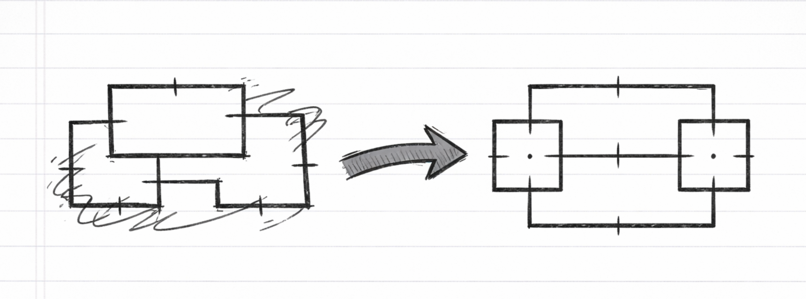

# boxlint



A linter and auto-fixer for Unicode box-drawing diagrams.

[](https://github.com/davetashner/boxlint/actions/workflows/ci.yml)
[](https://codecov.io/gh/davetashner/boxlint)

## Installation

### Prerequisites

A [Rust toolchain](https://rustup.rs/) (1.75 or later).

### From crates.io

```bash
cargo install boxlint
```

### From source (git)

```bash
cargo install --git https://github.com/davetashner/boxlint.git
```

This builds and installs the `boxlint` binary to `~/.cargo/bin/`.

### Build manually

```bash
git clone https://github.com/davetashner/boxlint.git
cd boxlint
cargo build --release
```

The binary will be at `target/release/boxlint`.

## Usage

```bash
boxlint lint diagram.txt       # Print diagnostics
boxlint fix diagram.txt        # Auto-fix to stdout
boxlint fix diagram.txt -i     # Auto-fix in place
```

## Example

**Before** — a diagram with alignment issues:

```
┌──────────┐
│  Service │
└──────────┘
       │
       ▼
  ┌────────────┐     ┌──────────┐
  │  Database   │────►│  Cache  │
  └────────────┘     └──────────┘
```

Problems:
- The arrow from "Service" is not centered under the box
- "Database" box edge widths don't match the content
- The horizontal arrow between boxes is misaligned vertically

**After** — the same diagram, corrected:

```
┌──────────┐
│  Service │
└────┬─────┘
     │
     ▼
┌──────────┐     ┌─────────┐
│ Database │────►│  Cache  │
└──────────┘     └─────────┘
```

## What it checks

- **Box corners and edges** — mismatched corner characters (`┌` with `╗`), gaps in edges
- **Box content alignment** — text overflowing box boundaries, inconsistent alignment
- **Arrow connections** — arrows that don't connect to box edges, misaligned segments

## License

MIT
